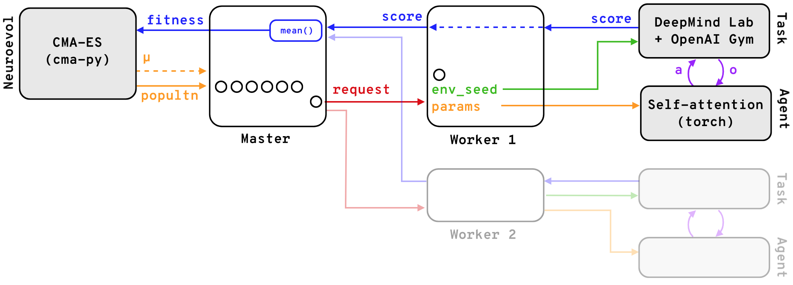
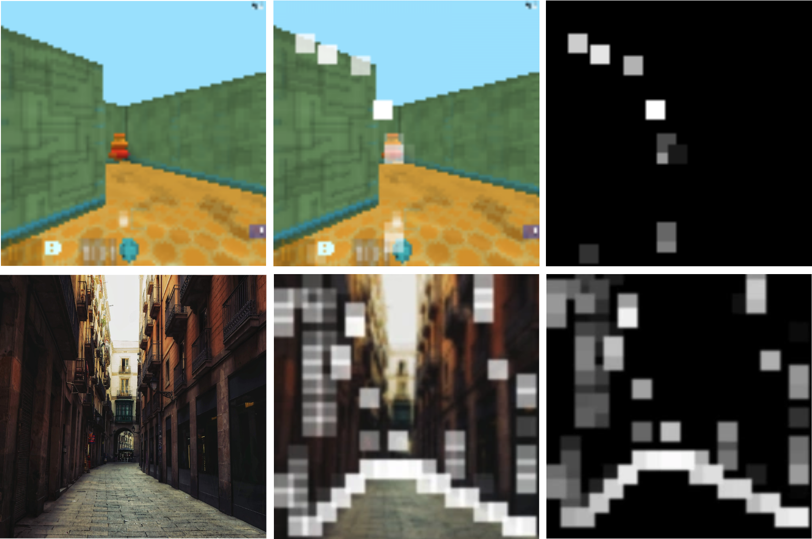
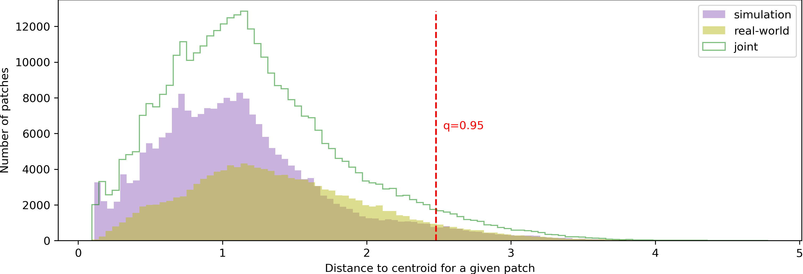
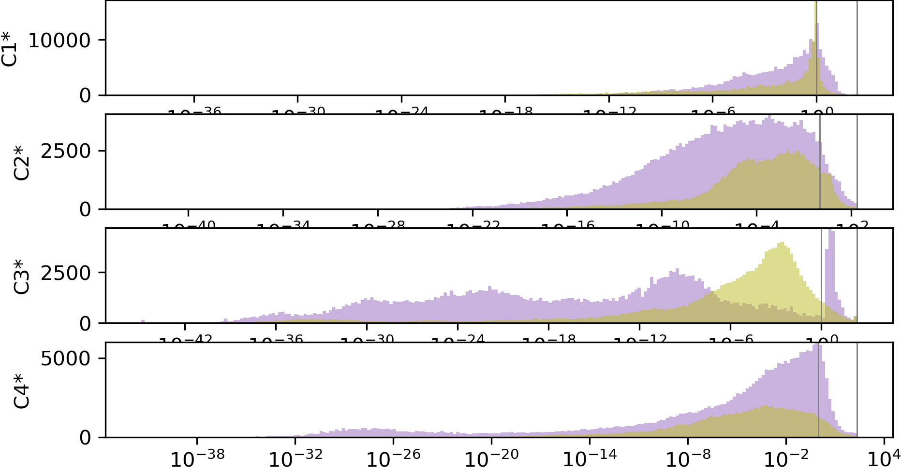

## Problem statement

</img>
<figcaption style="text-align: left; padding-top: 0;">
Assistive vision consists of a camera that captures the real world, with
images processed by a video processing unit (VPU), converting them into scene
representations that can be rendered in assistive displays of different kinds.
We train a self-attention network in a RL context to select important parts of
images for 3D navigation. Once trained, the SA network can be deployed
to the visual prostheses’ VPU to perform the vision processing.
</figcaption>

With the goal of simplifying visual representations of scenes
for navigation by selecting relevant features, we build upon
the work of Tang et al. <dt-cite key="Tang2020"></dt-cite>,
adapting the RL agent they introduced to enable training in a 3D navigation simulation environment. We
propose several methods to enhance the selected features,
and adapt the vision processing pipeline to present the obtained representations through different display modalities,
highlighting the method’s versatility. The resultant visualisations’ task-relevant features are enhanced, and those
irrelevant removed, effectively increasing the signal-to-noise ratio.

______

## Training in simulation

The agents are trained in Deepmind Lab <dt-cite key="Beattie2016"></dt-cite>
"NavMaze" simulation environments with RGB-D observations (or variations thereof),
and an action space size of 3.

<video class="b-lazy" src="assets/mp4/d2_10_0_overlay.mp4" type="video/mp4" autoplay muted playsinline loop style="margin: 0; width: 100%;" ></video>
<figcaption style="text-align: left; padding-top: 0;">
The self-attention models are trained in a reinforcement learning context by means of neuroevolution.
During training, the LSTM controller part of the network makes all decisions based solely on the
location of the top <i>K</i> most important image patches. This figure shows agent <i>d2</i> navigating environment
<i>NavMazeStatic01</i>.
</figcaption>

</img>
<figcaption style="text-align: left; padding-top: 0;">
The agents can learn to navigate the environment effectively with less than
100 million  training  observations (~200 iterations × 64 population/iter. ×
8 episodes/pop. × 900 observations/episode ≈ 92E6 observations), taking ~3h of wall time in our infrastructure.
This figure shows agent <i>d2</i> learning in environment <i>NavMazeStatic01</i>.
</figcaption>

</img>
<figcaption style="text-align: left; padding-top: 0;">
To make the training process more scalable and marginally faster, we completely decoupled the CMA-ES
population from the training task queue. Task requests, including population member
identifier and agent parameters for the given population member are placed in a
queue and undertaken by compute workers on a FIFO basis. This makes the training
more flexible and suitable for distributed computing.
</figcaption>

___________

## Vision processing in real-world scenes

</img>
<figcaption style="text-align: left; padding-top: 0;">
The representations learnt in simulation translate to the real-world.
Hyperparameters can be adjusted in real time in the final application. For example,
in this figure, <i>K=10</i> patches are selected in training, whereas <i>K=80</i>
patches are selected in the real-world image.
</figcaption>

Below we show different feature retrieval methods applied to real-world RGB-D video.

### Importance-luminance: ranking

<video class="b-lazy" src="assets/mp4/C1star_10_0_overlay.mp4" type="video/mp4" autoplay muted playsinline loop style="margin: 0; width: 100%;" ></video>
<figcaption style="text-align: left; padding-top: 0;">
Patch brightness is based on its importance ranking.
</figcaption>

$f(q, Q_k) = I_k / \max_{n\in N}\{I_n\}$

### Importance-luminance: log scale

### Depth sampling: patch minimum

$f(q, Q_k) {=} \min_{q'\in Q_k}\{\text{depth}(q')\} (I_k / \max_{n\in N}\{I_n\})$

### Depth sampling: per-pixel

Sampling depth data from the input image at the patch location, using per-pixel depth data: $f(q, Q_k) {=} \text{depth}(q) (I_k / \max_{n\in N}\{I_n\})$

<video class="b-lazy" src="assets/mp4/rw-depth-pp-C4star_10_0_overlay.mp4" type="video/mp4" autoplay muted playsinline loop style="margin: 0; width: 100%;" ></video>
<figcaption style="text-align: left; padding-top: 0;">
Having selected the most important patches, we can sample per-pixel depth data for the final visualisation.
</figcaption>

___________

## Display modalities

### Simulated Phosphene Visualisation

<video class="b-lazy" src="assets/mp4/TODO.mp4" type="video/mp4" autoplay muted playsinline loop style="margin: 0; width: 100%;" ></video>
<figcaption style="text-align: left; padding-top: 0;">
Simulated Phosphene Visualisation (SPV)
</figcaption>

</img>
<figcaption style="text-align: left; padding-top: 0;">
SPV of different output modes (refer to Figure 5 in the paper).
</figcaption>

### vOICe

<dt-cite key="Meijer1993"></dt-cite>

_________________

## Patch Analysis

</img>
<figcaption style="text-align: left; padding-top: 0;">
caption
</figcaption>

</img>
<figcaption style="text-align: left; padding-top: 0;">
caption
</figcaption>

